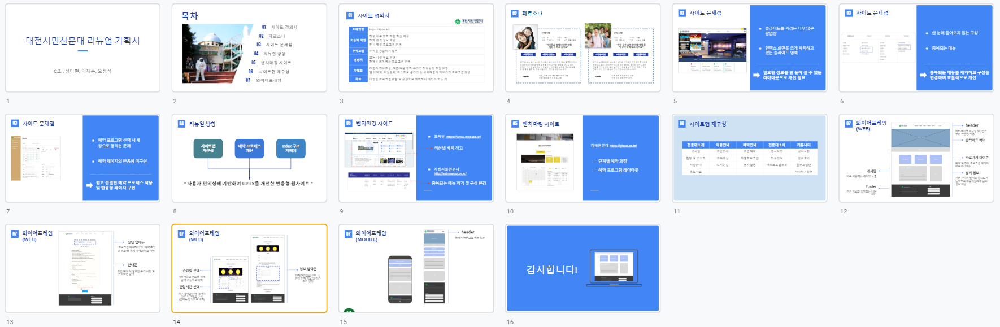

# 대전시민천문대 리뉴얼 프로젝트

HTML5, CSS3, JavaScript를 활용한 대전시민천문대 예약과정 리뉴얼 프로젝트

## 🙋 프로젝트 소개

'[대전시민천문대](https://djstar.kr/)' 의 예약 과정 리뉴얼을 진행하였습니다.

조원인 '오정석, 정다현'과 함께 리뉴얼 방향, 웹사이트 와이어프레임 구성을 진행하였고,

실질적인 시안 디자인 및 구현(퍼블리싱)은 개인적으로 진행하였습니다.

index 페이지를 통해 예약 페이지로 이동 할 수 있습니다.

예약 페이지로 넘어가면, 예약시 주의사항과 예약 과정이 나타나게 됩니다.

---

### ⌛ 개발 기간

2023.02.24일 ~ 2023.03.22일

### ⚙ 개발 환경

`Visual Studio code` 를 통해 개발을 진행했습니다.

팀원들과 협업은 `Figjam` 을 통해 진행하였습니다.

`Adobe Photoshop, Adobe Illustrator` 을 이용해 이미지 편집을 진행하였습니다.

`Figma`를 이용하여 디자인 시안 작업을 진행하였습니다.

### 📚 사용 언어

---

### 💬 참고사항

Calendar는 CodePen을 통해 관련된 자료를 찾아 페이지 제작에 사용했습니다.

index페이지에 날씨 API를 직접 연결하여 주간날씨와 일간날씨를 출력하였습니다.

예약 프로세스의 동의사항 미체크시 안내문구 출력과, 입력칸의 내용을 정규식을 사용해 검사하여 일치하지 않을 경우 안내사항을 출력했습니다.

---

### 🔗 링크 모음

데모 링크 : <https://jeeun99.github.io/project02_observatoryRenewal/>

아이디어 회의 링크: [피그잼\_링크](https://www.figma.com/file/jUD7SwCGpqrjIb4ZrvU2p2/C%EC%A1%B0_%EB%8C%80%EC%A0%84%EC%8B%9C%EB%AF%BC%EC%B2%9C%EB%AC%B8%EB%8C%80_%ED%86%A0%EB%A1%A0?node-id=0%3A1&t=p4qmO3XJE6lk1slZ-1)

Figma 링크: [이제은\_대전시민천문대](https://www.figma.com/file/2IH0lBwZHnzt5uN3XujnfO/%EC%9D%B4%EC%A0%9C%EC%9D%80_%EB%8C%80%EC%A0%84%EC%8B%9C%EB%AF%BC%EC%B2%9C%EB%AC%B8%EB%8C%80?node-id=0%3A1&t=06WxilQU9liW1DXb-1)

리뉴얼 기획서: 아래 사진 클릭시 프레젠테이션으로 이동됩니다.

